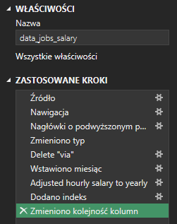
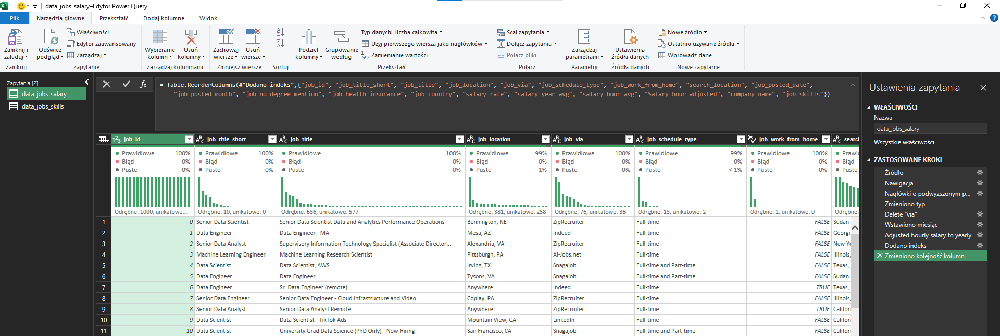
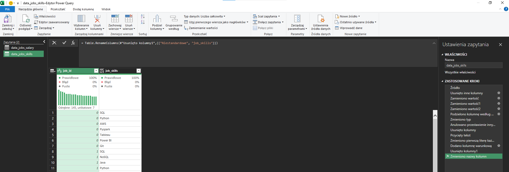
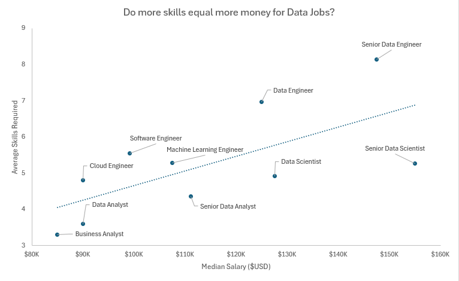
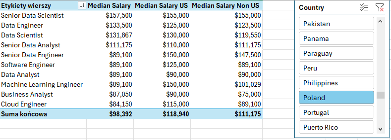
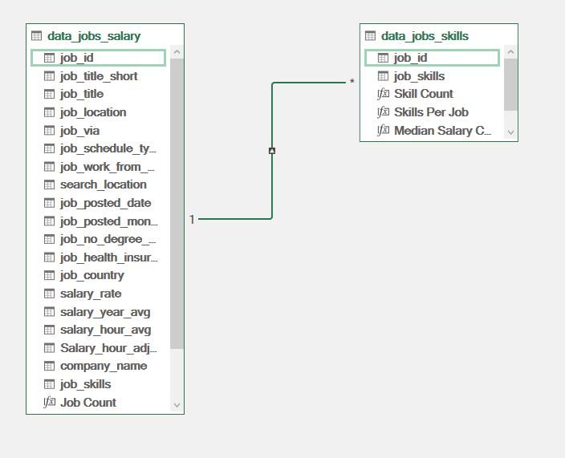
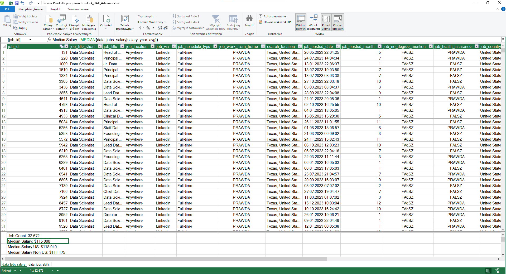
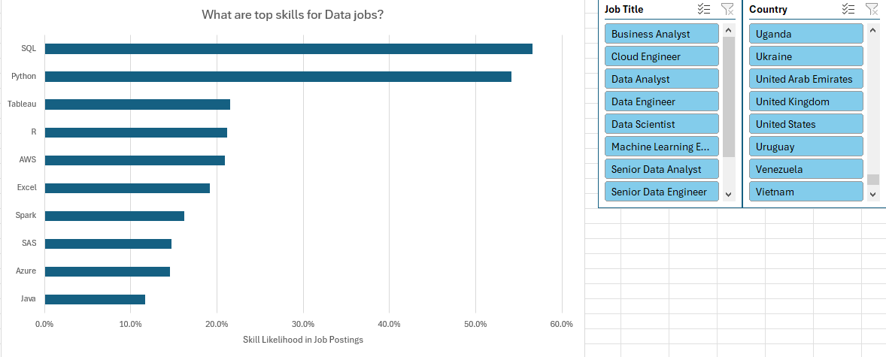
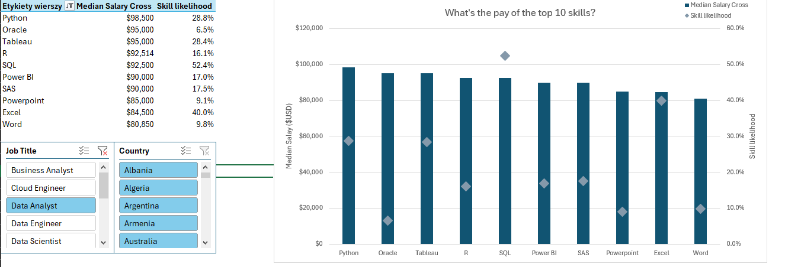

# Project 1 - Excel Salary Dashboard


## Introduction

This job salary dashboard was designed to assist job seekers in exploring salary data for their desired roles and ensuring they are receiving fair compensation.

The data comes from [Luke Barousse](https://www.lukebarousse.com/) course, which offers a solid foundation in data analysis using this powerful tool. It includes detailed information on job titles, salaries, locations, and key skills, all of which are featured in this dashboard.

### Dashboard File
Final dashboard is in [Salary_Dashboard](Project_1-Dashboard/Salary_Dashboard.xlsx).

### Excel Skills Used

The following Excel skills were utilized for analysis:

- **Charts**
- **Formulas and Functions**
- **Data Validation**

### Data Jobs Dataset

The dataset used in this project features real-world data science job information from 2023. The dataset provides detailed insights into:

- **Job titles**
- **Salaries**
- **Locations**
- **Skills**

## Conclusion

I developed this dashboard to highlight salary trends across different data-related job titles. It helps users make informed decisions about their career paths by exploring how factors like location and job type impact salaries.

# Project 2 - Analysis

## Introduction

As a job seeker, I’ve always been curious about the lack of data on the most in-demand jobs and skills in the data science field. This led me to explore what skills top employers are seeking and how to secure higher pay.

### Key Questions for Analysis

To gain insights into the data science job market, I explored the following questions:

1. **Do more skills get you better pay?**
2. **What’s the salary for data jobs in different regions?**
3. **What are the top skills of data professionals?**
4. **What’s the pay for the top 10 skills?**

### Excel Skills Used

The following Excel skills were utilized for analysis:

- **Pivot Tables**
- **Pivot Charts**
- **DAX (Data Analysis Expressions)**
- **Power Query**
- **Power Pivot**

### Data Jobs Dataset

The dataset used in this project features real-world data science job information from 2023. The dataset provides detailed insights into:

- **Job titles**
- **Salaries**
- **Locations**
- **Skills**

## 1. Do more skills get you better pay?

### Skill: Power Query (ETL)

#### Extract

- I began by using Power Query to extract the original data (`data_salary_all.xlsx`) and create two separate queries:
    - The first query contained all the data job information.
    - The second query listed the skills associated with each job ID.

#### Transform

- Next, I transformed each query by adjusting column types, removing irrelevant columns, cleaning the text to remove specific words, and trimming any excess whitespace.
    - **data_jobs_salary**

        

    - **data_job_skills**

        

#### Load

- Finally, I loaded both transformed queries into the workbook, establishing the foundation for my next phase of analysis.
    - **data_jobs_salary**

        

    - **data_job_skills**

        

### Analysis

#### Insights

- A positive correlation exists between the number of skills listed in job postings and the median salary, especially for positions such as `Senior Data Engineer`. Roles that require fewer skills, like `Business Analyst`, typically offer lower salaries, indicating that more specialized skill sets are associated with higher market value.



#### **Conclusion**

- This trend highlights the importance of gaining a diverse set of relevant skills, especially for those aspiring to secure higher-paying positions.

## 2. What’s the salary for data jobs in different regions?

### Skills: PivotTables & DAX

#### DAX

- To calculate the median year salary I used DAX.

    ```
    Median Salary := MEDIAN(data_jobs_salary[salary_year_avg])
    ```

#### Pivot Table

- I created a PivotTable using the Data Model I created with Power Pivot.
- I moved the `job_title_short` to the rows area and `Median Salary` into the values area.
- Then I added new measure to calculate the median salary for United States jobs and Non US jobs.
    ```
    =CALCULATE(
        [Median Salary];
        data_jobs_salary[job_country]="United States")
    ```
- Non US jobs.
    ```
    =CALCULATE(
        [Median Salary];
        data_jobs_salary[job_country]<>"United States")
    ```


### Analysis

#### Insights

- Job roles such as `Data Engineer` and `Data Scientist` offer higher median salaries both in the US and internationally, reflecting the global demand for advanced data expertise.
- The salary gap between US and non-US positions is especially pronounced in high-tech jobs, likely due to the concentration of tech industries in the US.



#### **Conclusion**

- These salary insights are crucial for strategic planning and negotiations, enabling professionals and companies to align their offers with market standards while accounting for regional differences.

## 3. What are the top skills of data professionals?

### Skill: Power Pivot

#### Power Pivot

- I built a data model by combining the `data_jobs_salary` and `data_jobs_skills` tables into a single model. 
- Since I had already cleaned the data using Power Query, Power Pivot automatically established a relationship between the two tables.

#### Data Model

- I created a relationship between my two tables using the `job_id` column.



#### Power Pivot Menu

- The Power Pivot menu was used to refine my data model and makes it easy to create measures.



### Analysis

#### Insights

- `SQL` and `Python` are the leading skills in data-related roles, highlighting their essential role in data processing and analysis.
- Emerging technologies such as `AWS` and `Azure` are also prominently featured, emphasizing the industry's move towards cloud services and big data solutions.



#### Conclusion

- Recognizing the most sought-after skills in the industry helps professionals remain competitive and informs training and educational programs to concentrate on the most influential technologies.

## 4. What’s the pay of the top 10 skills? (for Data Analyst)

### Skill: Advanced Charts (Pivot Chart)

#### PivotChart

- I created a combo PivotChart to plot median salary and skill likelihood (%) from my PivotTable.
    - **Primary Axis:** Median Salary (as a Clustered Column)
    - **Secondary Axis:** Skill Likelihood (as a Line with Markers)

### Analysis

#### Insights

- Skills such as `Python`, `Oracle`, and `SQL` are linked to higher median salaries, highlighting their crucial role in high-paying tech jobs.
- On the other hand, skills like `PowerPoint` and `Word` are associated with lower median salaries and fewer opportunities, reflecting their lower specialization and demand in high-paying sectors.



### Conclusion

- This chart emphasizes the value of dedicating time to learning high-demand skills like `Python` and `SQL`, which are clearly linked to higher-paying roles, particularly for those aiming to maximize their earnings in the tech industry.

## Summary


As a data enthusiast, I initiated this Excel-based project to gain valuable insights into the data science job market. Using a dataset sourced from real-world job postings, I analyzed job titles, salaries, locations, and key skills. By utilizing Excel tools such as `Power Query`, `PivotTables`, `DAX`, and `charts`, I identified significant correlations between multiple skills and higher salaries, especially in `Python`, `SQL`, and `cloud technologies`.

I hope this project serves as a practical resource for data professionals and offers an overview of the skills required for securing higher-paying roles.